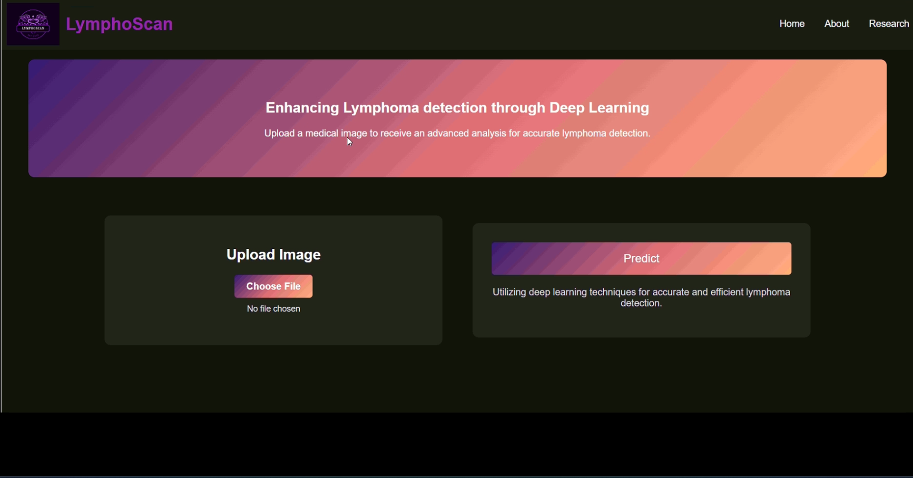
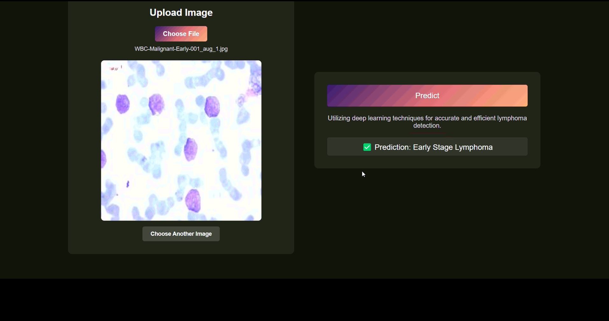
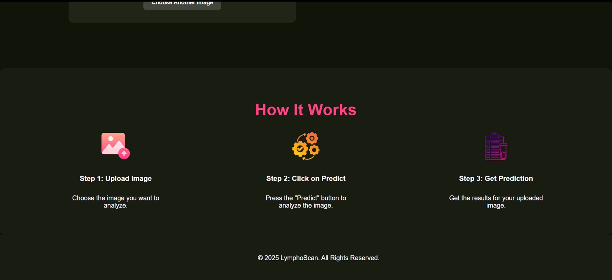

# LymphoScan — Run Guide (HTML-first)

LymphoScan is a lightweight **HTML/CSS/JS** UI for lymphoma image screening. The UI runs as a static site (open `index.html`). An **optional Flask backend** can be started to serve model predictions.

> Implementation is based on a Swin Transformer + Flask workflow; this README focuses only on how to run the code.

---

## Option A — Frontend Only (HTML)
No installs required.
1. Open `index.html` in your browser.
2. Ensure `styles.css` and `scripts.js` are in the same folder as `index.html` (or update the paths inside `index.html`).

This is enough for UI review/screenshots under an **HTML** category.

---

## Option B — Frontend + Backend (Flask API)

### Prerequisites
- Python 3.9+
- (Optional) Virtual environment
  ```bash
  python -m venv venv
  # Windows
  venv\Scripts\activate
  # macOS/Linux
  source venv/bin/activate
  ```

### Install Dependencies
If the repo includes `requirements.txt`:
```bash
pip install -r requirements.txt
```
Otherwise, minimal install (adjust as needed):
```bash
pip install Flask transformers timm torch torchvision pillow numpy
```

### Model Weights
- If `app.py` expects a local weights file, place it where the script looks (e.g., `weights/model.pth`) or edit the variable/path in `app.py`.
- If the app downloads a model automatically, no action is needed.

### Start the Backend
```bash
python app.py
```
By default the server runs at: **http://127.0.0.1:5000**

### (Optional) Test the API directly
```bash
curl -X POST -F "file=@docs/In1.png" http://127.0.0.1:5000/predict
```
Replace `docs/In1.png` with any local test image.

### Point the Frontend to the API
If the UI makes fetch calls, set the base URL in `scripts.js` (for example):
```js
const API_URL = "http://127.0.0.1:5000";
// fetch(`${API_URL}/predict`, { method: "POST", body: formData });
```
Then open `index.html` in your browser to use the end‑to‑end flow.

---

## Project Layout
```
index.html
styles.css
scripts.js
docs

#backend
app.py
model_architecture.py
preprocess.py
Predict.py
train_model.py
evaluate_model.py
check_dataset.py
```

## Screenshots in README
## Screenshots




---

## Notes
- For HTML‑only submissions, Option A is sufficient. Option B is for a working demo with predictions.
- If ports/host differ, update them in both `app.py` and `scripts.js`.
- Use a virtual environment to keep dependencies isolated.
